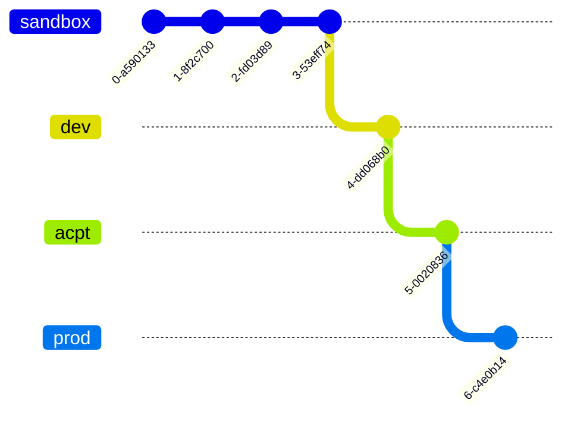
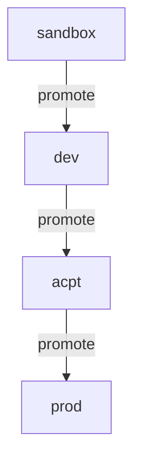

```mermaid
  %%{init: {"gitGraph": {"mainBranchName": "sandbox"}} }%%
  gitGraph
       commit
       commit
       commit
       commit
       branch dev
       commit
       branch acpt
       commit
       branch prod
       commit

```

```mermaid
flowchart TD
  S[sandbox] -->|promote| D[dev]
  D -->|promote| A[acpt]
  A -->|promote| P[prod]
```
